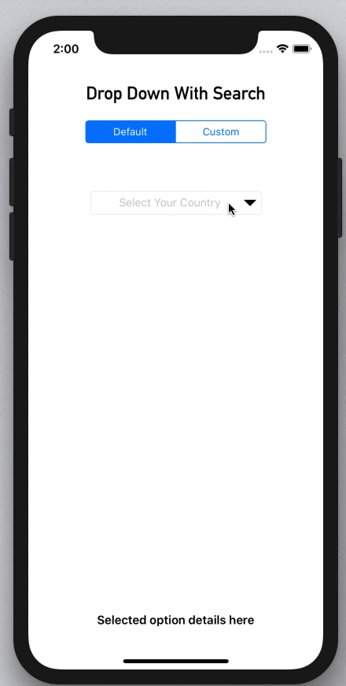
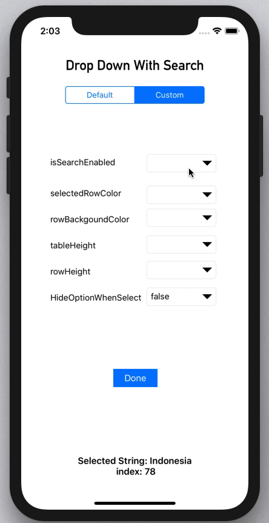
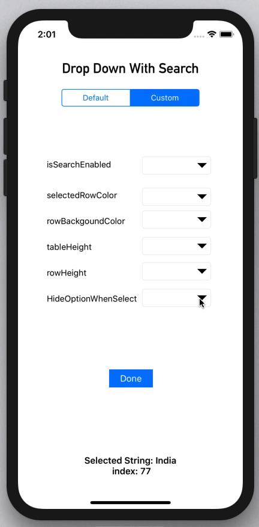
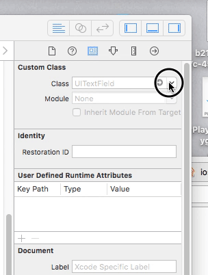
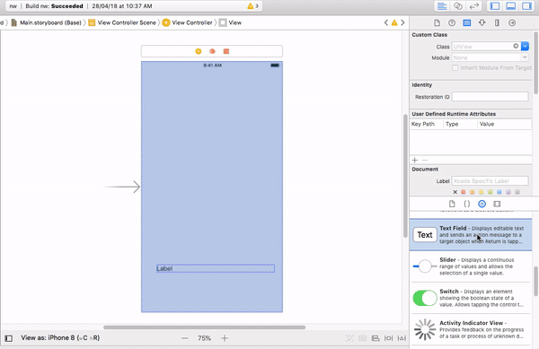

# iOSDropDown

[](https://cocoapods.org/pods/iOSDropDown)
[](http://cocoadocs.org/docsets/DropDown/)
[](https://developer.apple.com/swift/)
[](LICENSE)
[](https://cocoapods.org/pods/iOSDropDown)
[]()

## Drop Down With Search
It's a Swift Library to support Drop Down Menu in iOS
### Support Search and Return Correct index
[](images/1.gif)
### Customizing
[](images/2.gif)
### hideOptionWhenSelect = false
[](images/3.gif)


## Example

To run the example project, clone the repo, and run `pod install` from the Example directory first.

## Features
 1. Simple UITextField Extension And simple to use  , We can Access all properties of UITextField
    [](images/4.gif)
 2. DropDown Search can enable or desable
 3. Change color of List backgound and selected color 
 4. Change Maximum Hieght of List and Height of each Row

## Installation
### CocoaPods

Use [CocoaPods](http://www.cocoapods.org).
iOSDropDown is available through [CocoaPods](https://cocoapods.org). To install
it, simply add the following line to your Podfile:
1. Add `pod 'iOSDropDown'` to your *Podfile*.
2. Install the pod(s) by running `pod install`.
3. Add `import iOSDropDown` in the .swift files where you want to use it

### Carthage

Use [Carthage](https://github.com/Carthage/Carthage).

1. Create a file name `Cartfile`.
2. Add the line `github "jriosdev/iOSDropDown"`.
3. Run `carthage update`.
4. Drag the built `iOSDropDown.framework` into your Xcode project.

### Manual

Just clone and add the following Swift files to your project:
- iOSDropDown.swfit

## Basic usage ✨
### StoryBoard Method
  Simple
[](images/5.gif)
### Code
```swift
let dropDown = DropDown()
dropDown.frame = CGRect(x:50 ,y:70 , width:200 , height:40)  //Set frame

// The list of array to display. Can be changed dynamically
dropDown.dropDown.optionArray = ["Option 1", "Option 2", "Option 3"]

// The the Closure returns Selected Index and String 
dropDown.didSelect{(selectedText , index) in
self.valueLabel.text = "Selected String: \(selectedText) \n index: \(index)"
}

```
### Other Options
 Actions 
 
   ```swift
    dropDown.showList()  // To show the Drop Down Menu
    dropDown.hideList() // To hide the Drop Down Menu
   
````

Closures

 ```swift
  listWillAppear() {
   //You can Do anything when iOS DropDown willAppear 
  }
 
 listDidAppear() {
     //You can Do anything when iOS DropDown listDidAppear
 }
 
 listWillDisappear() {
   //You can Do anything when iOS DropDown listWillDisappear 
 }
 
  listDidDisappear() {
   //You can Do anything when iOS DropDown listDidDisappear
 }
 ```

## Customize iOSDropDown 🖌

You can customize these properties of the drop down:
- `isSearchEnabled ` : You can Enable or Desable on DropDown .Default value Is `true`
- `hideOptionsWhenSelect` : This  option to hide the list when click option one item. Default value is `true`
- `selectedRowColor` : Color of selected Row item in DropDown Default value is `.cyan`
- `rowBackgroundColor` : Color of  DropDown Default value is `.white`
- `tableHeight`: The maximum Height of of List. Default value is `100 ` 
- `rowHeight`: The  Height of of List in the List. Default value is `50`


## Author

Jishnu RajT, jriosdev@gmail.com
[](https://twitter.com/jishnurajt)

## License

iOSDropDown is available under the MIT license. See the LICENSE file for more info.
